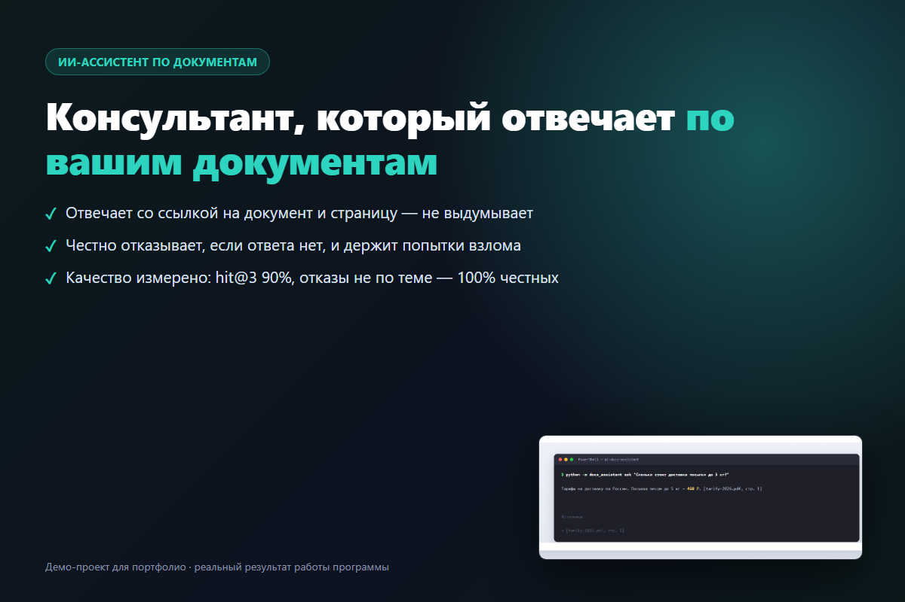
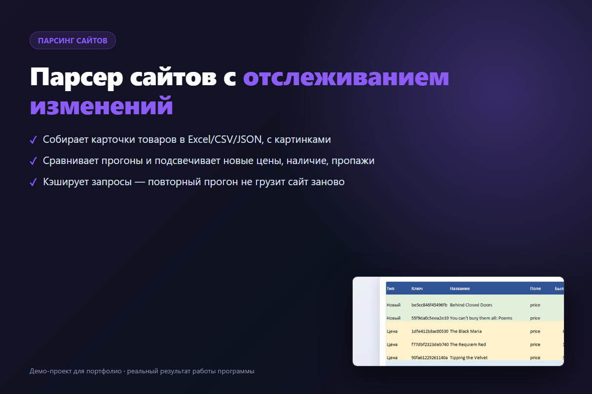
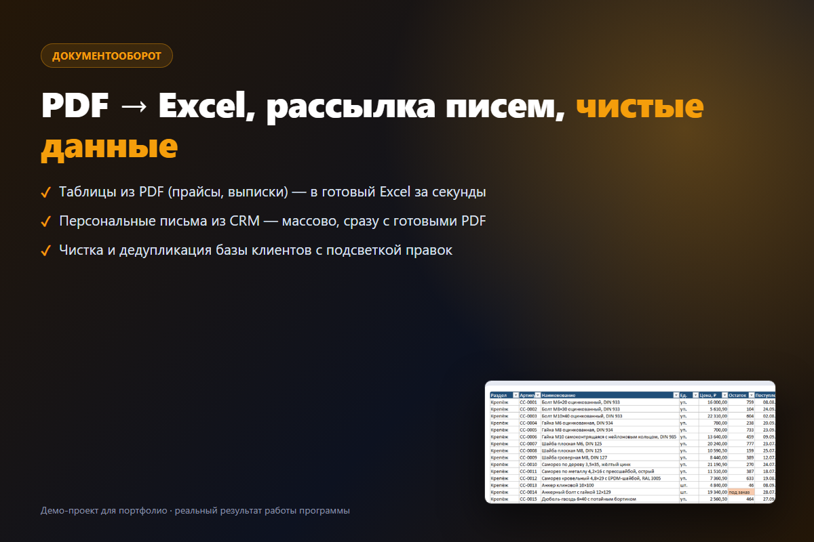
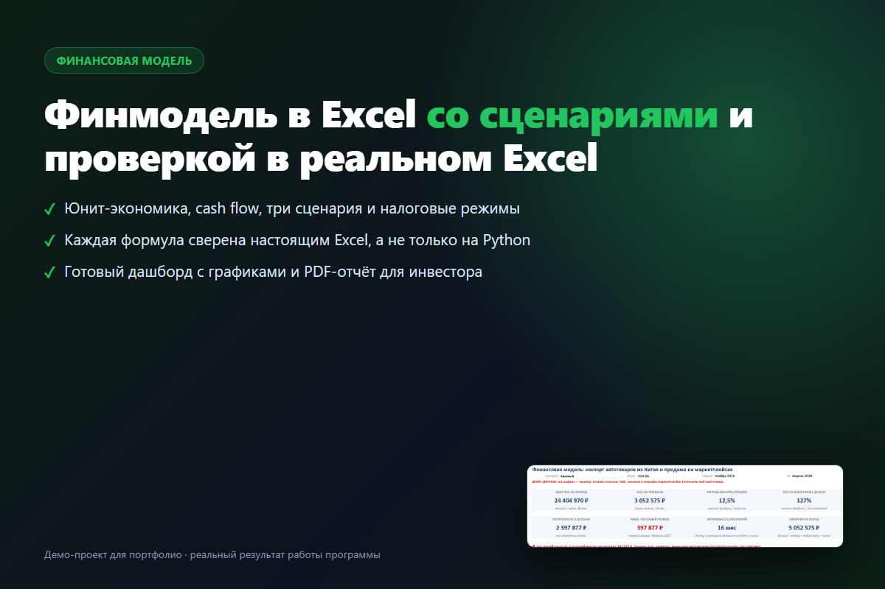
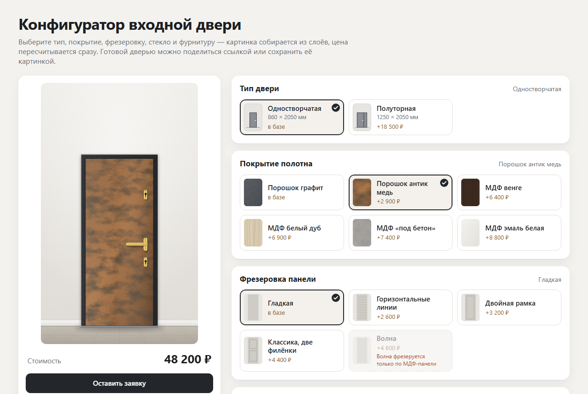

# Портфолио: автоматизация для малого бизнеса

Шесть рабочих демо-проектов — боты, ИИ-консультант, парсинг, документы, Excel и веб-конфигуратор. Каждый проект
запускается, покрыт тестами и снабжён инструкцией. Данные во всех демо вымышленные или взяты с
учебных сайтов, созданных для тренировки парсеров.

Код написан с помощью ИИ-ассистента; результат каждого проекта проверен запуском и тестами, а
файлы Excel и Word — открытием в настоящих Excel и Word.

| | Проект | Что делает | Стек |
|---|---|---|---|
|  | [Бот приёма заявок для Telegram и MAX](leads-bot/) | согласие на обработку ПДн → услуга, имя, телефон → заявка в рабочий чат; антиспам, `/stats`, выгрузка в Excel | Python, aiogram, SQLite, Docker |
|  | [ИИ-консультант по документам компании](ai-docs-assistant/) | отвечает по PDF/Word/Markdown со ссылкой на файл и страницу, честно отказывает вне темы; метрики качества | Python, aiogram, YandexGPT / GigaChat / OpenAI-совместимые, офлайн-режим, Docker |
|  | [Парсер сайтов с отслеживанием изменений](site-parser/) | каталог → Excel / CSV / JSON / Google Таблицы с картинками; сравнение прогонов, отчёт и уведомление в Telegram, запуск по расписанию | Python, requests, BeautifulSoup, openpyxl |
|  | [Обработка документов и таблиц](doc-tools/) | таблицы из PDF в Excel, письма из CRM по шаблону Word, очистка и дедупликация баз, конвертация форматов | Python, pdfplumber, python-docx, openpyxl |
|  | [Финансовая модель в Excel](excel-finmodel/) | юнит-экономика, движение денег, сценарии и налоговые режимы, дашборд и PDF; каждая ячейка сверена настоящим Excel | Python, openpyxl, Excel COM |
|  | [Конфигуратор входной двери для сайта](door-configurator/) — **[открыть демо](https://kulcka.github.io/portfolio/door-configurator/)** | картинка из слоёв меняется с каждым выбором, цена пересчитывается сразу, правила совместимости, ссылка «Поделиться», PNG, форма заявки; все опции и цены — в одном файле настроек | HTML, CSS, JavaScript без сборки, тесты на Node |

Скриншоты настоящих результатов — в папке [`showcase/`](showcase/).

## Как запустить

У каждого проекта свой `README.md`: установка, запуск, тесты. Везде Python 3.11+:

```bash
cd site-parser
python -m venv .venv
.venv/Scripts/python -m pip install -r requirements-dev.txt   # Linux/macOS: .venv/bin/python
.venv/Scripts/python -m pytest
```

Секретов в репозитории нет: ключи и токены задаются в `.env` по образцу `.env.example`.
